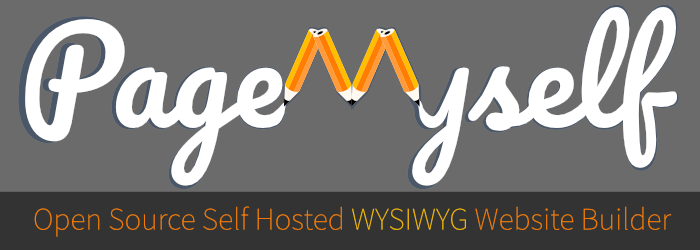

 

### PageMyself - Open Source Self Hosted WYSIWYG Website Builder

> The project's goal: Give you the tools to create your private/company website in no time and without coding skills. It is almost as easy as writing an office document.

### Pre-Alpha
This app is currently in pre-alpha, in constant changes. But, you can already download and install releases. We have a [docker setup](https://github.com/NullixAT/pagemyself-docker) as well, where you get this running with a few commands.

### Features
* WYSIWYG | What you see is what you get | Live edit text and other information directly on the homepage
* Self-hosted and open source
* Highly customizable | The whole page design can be changed very detailed, it may be a bit overhelming at first but we are working on a good tutorial series
* Easy installation | Setup just take minutes | Choose of multiple installation methods
* :heart: for devs | Built from the ground up for developers to integrate own themes, modules and plugins
* Multilanguage interface | Currently there is english and german, but plan is to integrate open-source translations as well

### Usage tutorial
We are working on a short youtube series that show installation and usage of PageMyself. Please give us some time.

### Installation with ZIP
You require a PHP 8.1 installation, a Mysql/MariaDB database and a running webhosting.
Once you have all that:
1. Download [https://github.com/NullixAT/pagemyself/releases/latest](latest release package): release-x.x.x.zip - > Which contains `install.php`, `package.zip` and a few other files. Do not unpack `package.zip` by hand, this is handled by the install script.
2. Upload to your webhosting and unpack
3. Open `https://yourdomain/install.php` in your browser, or whatever path you have choosen

### Installation with Docker
If you already have docker and want to run all that in a docker container, [we have something for you.](https://github.com/NullixAT/pagemyself-docker)

### Team
This project was created by me, [brainfoolong](https://github.com/brainfoolong). I hope that this evolves and the open-source team can grow. I do this in my spare time beside my full-time job as a web-dev. Let us discus about ideas here in Github issues or you can join [my discord](https://discord.gg/3TxmE3KZJY). I try to be as active as possible.

### Based on Framelix
This project is based on the [PHP 8.1+ Framework: Framelix](https://github.com/NullixAT/framelix-core) which is primarely designed for backend applications but also work well for PageMyself as it is highly customizable.

### Theme and Module Development
PageMyself was designed from the ground up to give devs a handsome tool to create own modules and themes easily. Currently a good documentation is missing, but i am working it. Please give me some time.