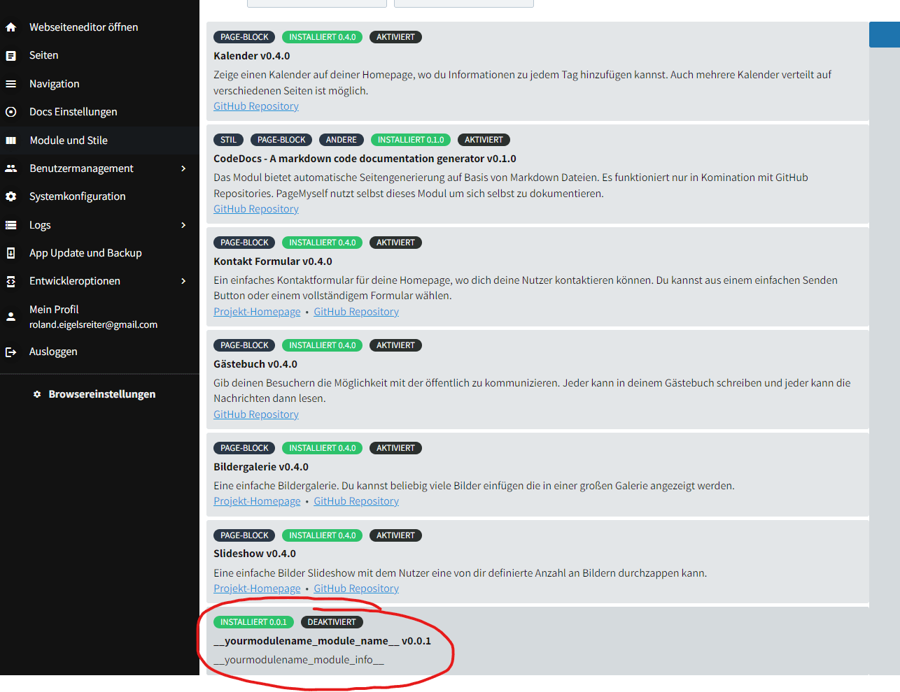

At first, you need your own module to start with.

There is a handy command line that creates the boilerplate for you.

From the root, call:

    php modules/Framelix/console.php createModule --module {YourModuleName}

After that, you should see a new folder in `modules` with your module name.

Also you should see a new module entry the backend, something like this

From that point on, you can start development of [themes](themes.md), [page-blocks](pageblocks.md) and [other things](more.md).

Ah, and don't forget to enable your module in the backend (above screenshot shows the page where you can do that) once you want to use it.