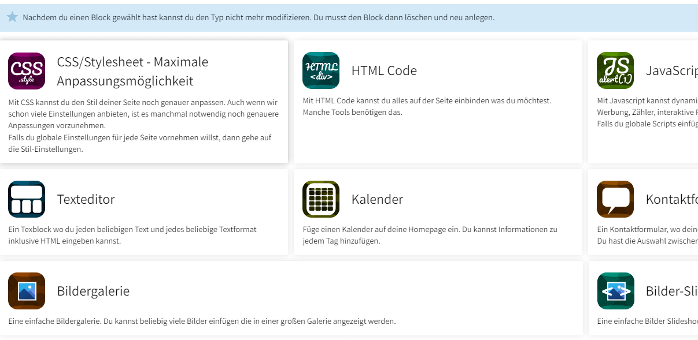

A page-block in PageMyself as the thing that a user can choose when editing page design like in the screenshot bellow.

---

---

To start, you have to [create your module](modules.md), if not done yet.

Then run following command line to create the pageblock boilerplate for you

    php modules/Framelix/console.php createPageBlock --module {YourModuleName} --pageBlockName {YourPageBlockName}

You should now have at least following files/folders:

    modules/YourModuleName/js/page-blocks/YourPageBlockName/script.js
    modules/YourModuleName/src/PageBlocks/YourPageBlockName.php
    modules/YourModuleName/scss/page-blocks/YourPageBlockName/style.scss

From this point, you can start developing your page block, but let's check each file what you should modify

### Reference

To learn from live examples, just check out the built-in page-blocks, like `Text`, `Css`, etc... it is a way easier to see how already existing things are made. Filepaths are the same as your new module, expect everything is in `Myself`.

### Compiled files for JS/SCSS

Compiled files comes automatically into `modules/YourModuleName/public/dist` and are updated each time you open any page where you theme is activated in the frontend.

### Javascript

`modules/YourModuleName/js/page-blocks/YourPageBlockName/script.js` - That's where all your frontend javascript comes in. If you need one... Pack all your code into the existing `initBlock` function. You can use newest JS features, everything will be compiled back to cross browser code for you.

### SCSS

`modules/YourModuleName/scss/page-blocks/YourPageBlockName/style.scss` - That's where all your CSS/SCSS comes in. You can write in bare CSS or you can use SCSS syntax as well. It will be automatically compiled to cross browser code for you.

### PHP

`modules/YourModuleName/src/PageBlocks/YourPageBlockName.php` - Contains your complete HTML and logic. By default, this does not create any HTML markup. Modify the boilerplate to your needs. If you have any more questions to this, please ask us in our Slack Chat or open an issue with your questions.

### Public/Static files

You probably need static files to be included, like images, etc... This all comes into `modules/YourModuleName/public`. To create a URL to a static file, use `Url::getUrlToFile($filePath)` - This will create a valid URL to a file on disk.

